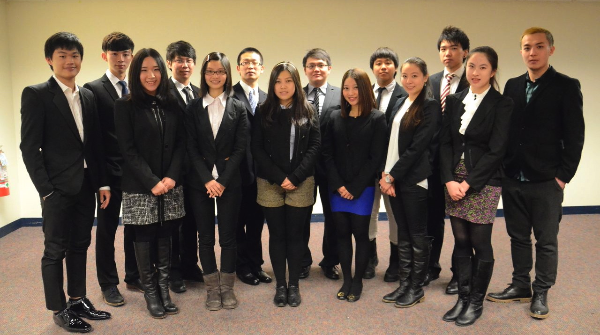
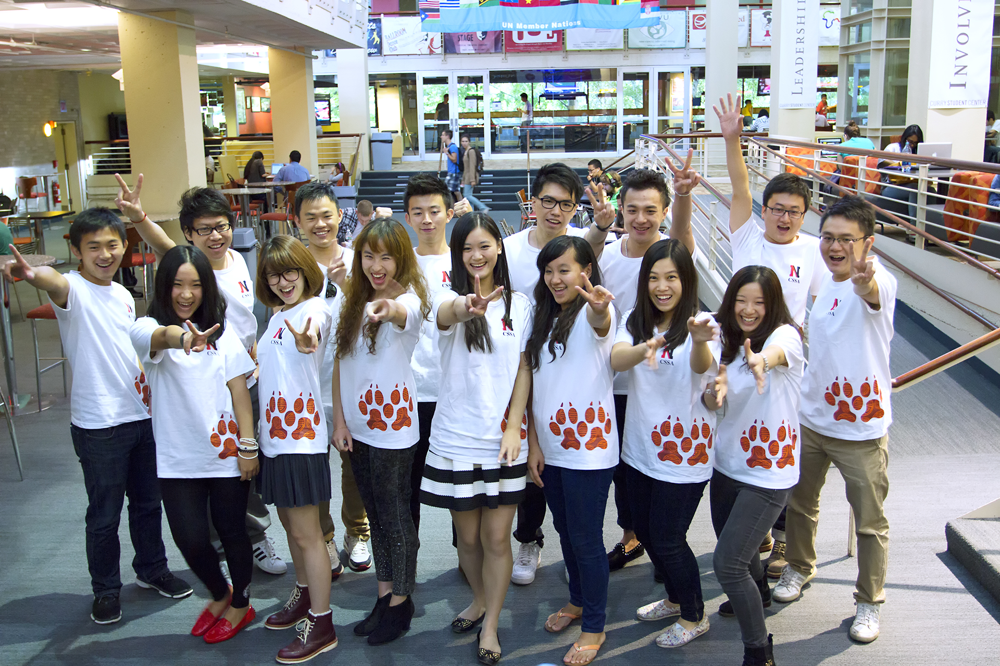
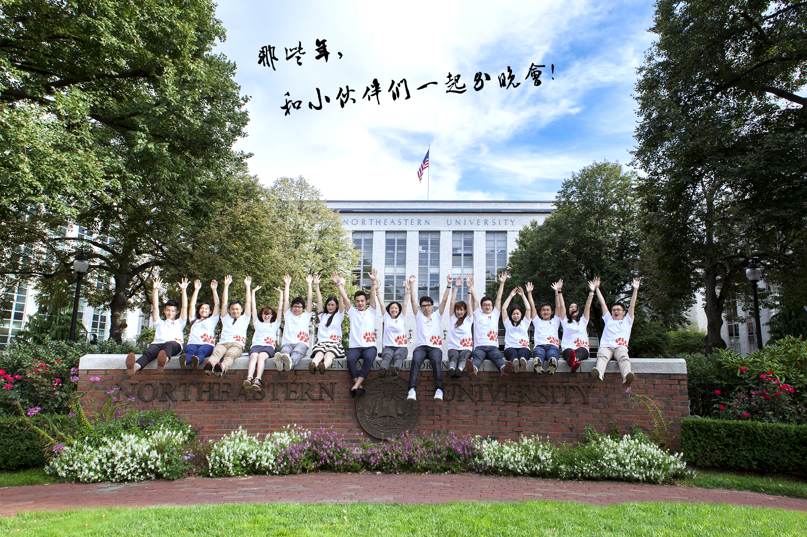

美国东北大学中国学生学者联合会，Northeastern University Chinese Students and Scholars Association，简称 NUCSSA 或 NEUCSSA，创建自2006年。我们是合法注册於美国东北大学 Northeastern University 研究生学生政府下的学生团体。同时我们也是中国驻纽约领事馆所承认的美国东北大学唯一的中国学联。

As a representative of all the Chinese students and scholars of Northeastern University, Northeastern University Chinese Students and Scholars Association, often referred to as NUCSSA, has an obligation of uniting and helping Chinese students and scholars who will study or are studying in Northeastern University, and our Chinese alumni, and promote the culture communications between Chinese community and other culture groups.

以下照片拍摄于2015年4月。包含了所有2015-2016届的核心委员会。

以下照片拍摄于2014年4月。包含了所有2014-2015届的核心委员会。

以下照片拍摄於2013年2月。包含了2012-2013 以及 部分 2013-2014 届的核心委员会。

以下照片摄于2013年9月，是2013-2014届的核心委员会。

我们是一个对任何族群都开放的社团，我们不执行封闭式的收费会员制度，所以可以随时报名参加到我们的活动中来加入我们。之后可以通过每年两次（10月以及次年4月）的【招新】竞选成为【干事Member】。再之后，可以通过每年一次（一般在4月初）的【纳新】竞选升格为我们的【Eboard 执行委员会干部】（四层架构：主席->主管->部长->副部长->干事），我们则会严格按照宪章执行考核。

1、参加我们活动

2、通过【每年两次】的【招新】，成为的我们【会员Member】

3、通过【一年一次】的【纳新】，成为我们的【干事Assistant】

4、通过【一年一次】的【纳新】，成为我们的【部长Director】

5、通过【一年一次】的【纳新】，成为为我们的【副主席Co-chair】

6、通过【一年一次】的【纳新】，成为为我们的【主席President】

# Advisor
## Nian-Xiang Sun

## Rebecca Regan

