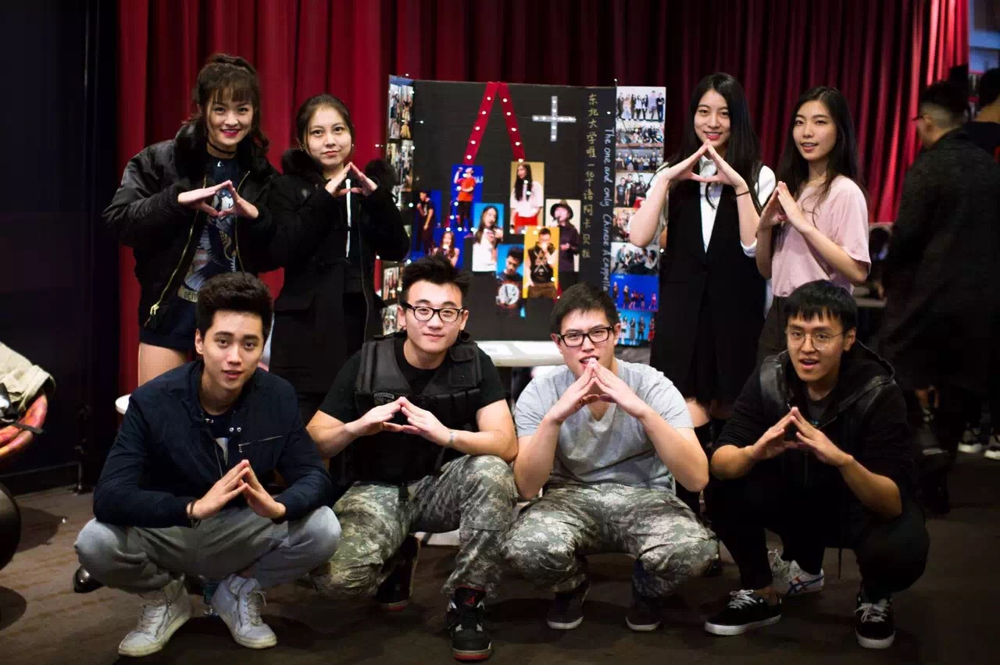
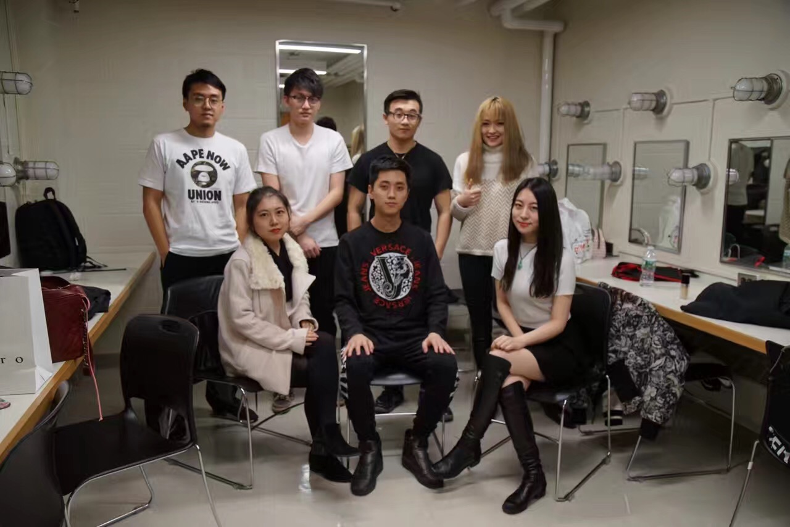

### 社团简介
A Plus 成立于2015年，是NUCSSA旗下一支年轻的，相对独立的非盈利无伴奏人声合唱团。目前，成员都由Northeastern University的中国学生组成。我们的所有曲目都是由成员选取华语歌曲自行改编，全部歌曲的编曲都为A Plus原创。我们目前的活动主要是组织社团内部成员每周参与练习，排演节目。主要在每季的招新与Workshop时对外开放。

我们计划在积累一定数量的固定曲目后，参与Northeastern University以及其他学校举办的活动，并制作视频上传至youtube等视频网站，争取提高A Plus的知名度，使A Plus成为NUCSSA 乃至Northeastern University的品牌。

欢迎每个热爱音乐的人加入我们！！

 

### 社团活动时间：暂定

 

### 招新标准：

有较好的音准、节奏感。也欢迎对BBox有经验的同学。有合唱经验者，有编曲能力者更佳。同时招收幕后成员（摄影，舞台编排，文案，视频录制，歌曲录制等）

